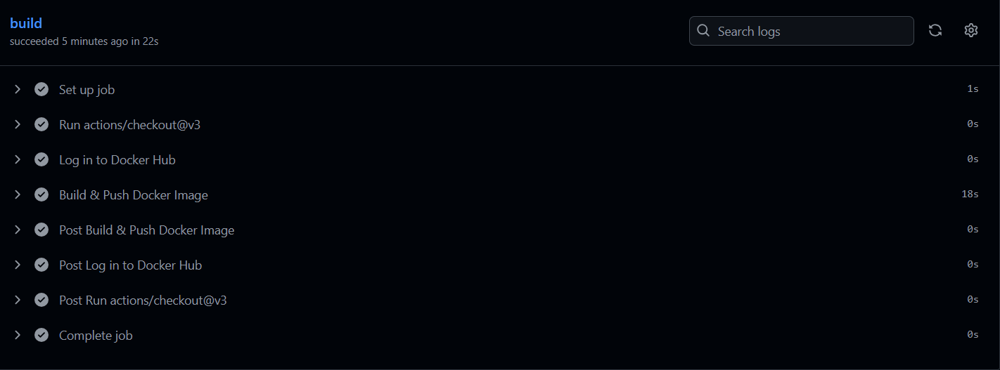
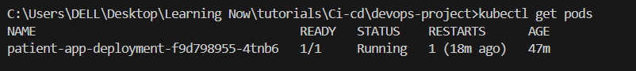
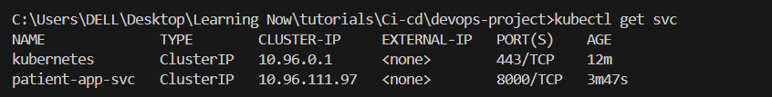
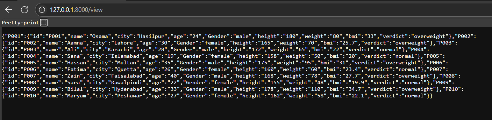

# Patient App – CI/CD with Docker, Helm & ArgoCD

[](https://github.com/OsamaCodes62/devops-project-Helm/actions/workflows/ci.yaml)

A simple FastAPI application deployed on Kubernetes with a complete CI/CD pipeline:

- FastAPI app containerized with Docker
- GitHub Actions builds & pushes Docker image to Docker Hub
- Helm chart manages Kubernetes deployment & service
- ArgoCD tracks chart state for GitOps
- Tested on Docker Desktop Kubernetes (kind)

---

## Features

- REST API with FastAPI (/, /about, /view, /view/{id}, /sort)
- Helm chart for deployment and service
- CI/CD pipeline that automatically:
  - Builds Docker image on each push
  - Pushes to Docker Hub: https://hub.docker.com/r/osamaehsaan/patient_app
- ArgoCD syncs manifests from GitHub
- Kubernetes cluster on Docker Desktop (kind, 2 nodes)

---

## Screenshots

CI workflow run (GitHub Actions)


Pods running in Kubernetes


Service created in Kubernetes


FastAPI response after port-forward


---

## Tech Stack

- Backend: FastAPI
- Containerization: Docker
- Orchestration: Kubernetes
- Package Manager: Helm
- GitOps: ArgoCD
- CI/CD: GitHub Actions

---

## Directory Structure

```
.
├── src/ # FastAPI source
├── docker/ # Docker setup
├── charts/ # Helm charts
│ └── sample-app/
│ └── templates/
├── argocd/ # ArgoCD manifests
├── infra/ # Infrastructure as code
│ └── terraform/
├── screenshots/ # Screenshots for README
└── .github/ # GitHub config
└── workflows/
```

---

## How to Run Locally

1. Run directly with FastAPI
   cd src
   pip install -r requirements.txt
   uvicorn app:app --reload
   Open: http://localhost:8000

2. Run with Docker
   docker build -t osamaehsaan/patient_app:latest -f docker/Dockerfile .
   docker run -p 8000:8000 osamaehsaan/patient_app:latest
   Open: http://localhost:8000

3. Run on Kubernetes with Helm
   kubectl get nodes
   helm upgrade --install patient-app charts/sample-app
   kubectl get pods
   kubectl get svc
   kubectl port-forward svc/patient-app-svc 8000:8000
   Open: http://localhost:8000

---

## CI/CD Flow

1. Edit and push code to GitHub (e.g., src/app.py)
2. GitHub Actions triggers on push:
   - Builds & pushes osamaehsaan/patient_app:latest to Docker Hub
3. Helm release points to latest image on cluster
4. ArgoCD tracks Helm chart in Git (GitOps)
5. Pods restart or rollout to pull new image:
   kubectl rollout restart deployment patient-app

---

## Future Improvements

- Integrate ArgoCD Image Updater for automatic redeploy on new image
- Add Ingress for custom hostname
- Add Horizontal Pod Autoscaler (HPA)

---

## Contributing

Feel free to fork this repo, open issues, and submit PRs!

---

## Contact

Osama Ehsaan  
GitHub: https://github.com/OsamaCodes62
